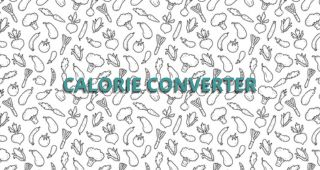
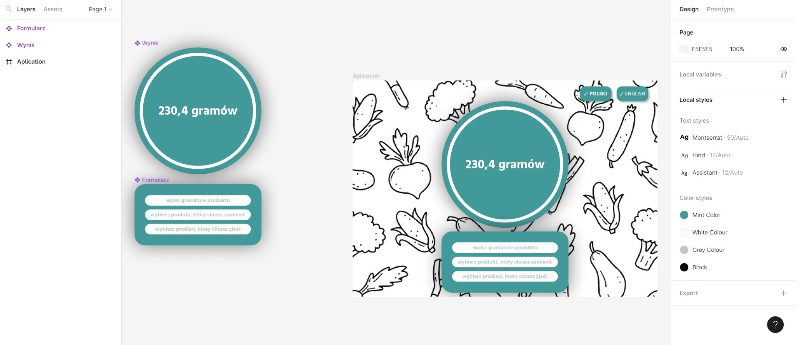

# Calorie Converter

## 📝 Table of Contents

<details>
  <summary>Expand</summary>
  <ol>
    <li><a href="#about-the-project">About The Project</a></li>
    <li><a href="#built-with">Build With</a></li>
    <li><a href="#getting-started">Getting Started</a></li>
    <li><a href="#solutions-provided-in-the-project">Solutions provided in the project</a></li>
    <li><a href="#inspirations-and-materials">Inspirations and Materials</a></li>
    <li><a href="#ideas-to-imporve-aplications">Ideas to imporve aplications</a></li>
    <li><a href="#feel-free-to-contact-me">Feel free to contact me</a></li>
  </ol>
</details>

## 🎉 About The Project

Aplication intend for person who is on diet. Aplication helps change weight one product for another product with maintaining calorie value for example when person would like change one kind of meat or vegetables for different.

<p align="right">(<a href="#calorie-converter">back to top</a>)</p>

## 🔧 Built With


<p align="right">(<a href="#calorie-converter">back to top</a>)</p>

## 💿 Getting Started

### Live

* <a href="https://marcinszawara.github.io/CalorieConverter/">Pages online</a>

### Instalation

1. Download <a href="https://code.visualstudio.com/">Visual Studio Code</a> or another code editing.
2. Instal <a href="https://git-scm.com/">GIT</a>
3. Instal NPM 
```sh
npm install
```
4. Downoload app with GIT
```sh
git clone https://github.com/MarcinSzawara/CalorieConverter.git
```

<p align="right">(<a href="#calorie-converter">back to top</a>)</p>

## 💭 Solutions provided in the project

1.  BEM Metodology - I used BEM metodologu for better comunication in project and better recognition.
```sh
<section class="aplication__circle-external">
    <div class="aplication__circle-internal">
        <div class="aplication__result aplication__number"></div>
        <div class="aplication__result aplication__text"></div>
    </div>
</section>
```

2. Mixins - I used Mixins in the place when i used flexbox to reduce a quantity of code and code will be more readable.
```sh
@mixin flexbox {
    display: flex;
    justify-content: center;
    align-items: center;
};
```
3. Breakpoints - I used breakpoints to better fit code to responsive webpage.
```sh
$breakpoints: (
    xsmall: "(min-width:460px)",
    small: "(min-width:640px)",
    medium: "(min-width:800px)",
    large: "(min-width:1024px)",
    xlarge: "(min-width:1200px)",
    xxlarge: "(min-width:1440px)",
);
```
4. Buttons - to applications we can add another language and we can add element with class "button".
```sh
<button data-option="pl" class="button language__polish"><i class="fa-solid fa-check" style="color: #ffffff;"></i>PL</button>
```
5. Responsive webpage - whole page is responsive and we can use them on all equipment.


<p align="right">(<a href="#calorie-converter">back to top</a>)</p>

## 💡 Inspirations and Materials
1. <a href="https://www.figma.com">Figma</a> - I used figma program for create a aplication design.



2. <a href="https://fontawesome.com/">Font Awesome</a> - I download icons with Font Awesome to beautify the application.
3. <a href="https://unsplash.com/">Unsplash</a> - i downloaded background pictrue with unsplash. Picture in background it's repeted, and this way it's better for responsive webpage.


<p align="right">(<a href="#calorie-converter">back to top</a>)</p>


## 🙋‍♂️ Feel free to contact me

email: [do not hestitate to write to me](mailto:szawara.marcin@gmail.com)

<p align="right">(<a href="#calorie-converter">back to top</a>)</p>


